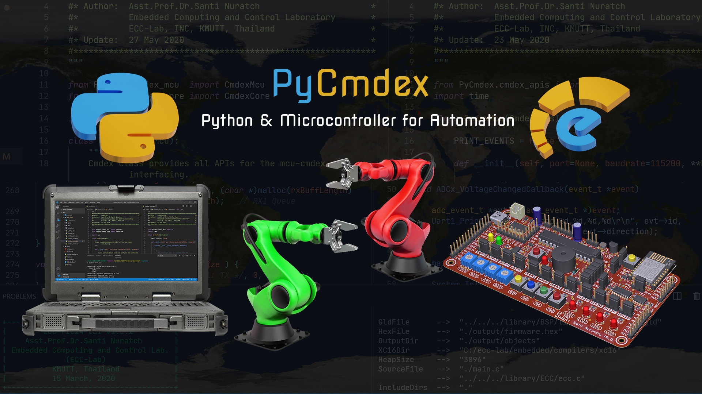

# PyCmdex

> Go to the [examples](./examples), if you already installed the `PyCmdex`

---


## PyCmdex library

The PyCmdex is a Python library used to develop computer and microcontroller cooperation applications. It provides plentiful APIs for microcontroller interfacing. With this library, you can make computer-based control and monitoring application easier and faster.




---

## Supported Microcontrollers

All of the microcontrollers running the Cmdex firmware can communicate to the PyCmdex through a serial port (UART). A USB-to-Serial adapter can be used. Note, the Cmdex firmware is a firmware of the microcontroller (not PyCmdex).

## Requirements

1) **Python 3.8** and **pip3** or higher.
2) The microcontroller board running the **Cmdex firmware**.
3) USB cable.

> The **Proteus** circuit simulator with Cmdex.hex can be used in the development process (no microcontroller board and USB cable are required).

## PyCmdex Installation using *pip3*

1) Uninstall the previous version

```
pip3 uninstall pycmdex
```

2) Install the latest version

```
pip3 install pycmdex
```

3) Open the git repository

```
pycmdex web
```

## Usage

1) Connect the microcontroller board to host computer or run the circuit simulator.

2) Write python script

``` python
# import the Cmdex
from PyCmdex.cmdex import Cmdex

# Create an instance of the Cmdex with debugging enabled
cmdex = Cmdex(debug_core=True)

# Turn the LED0 on.
cmdex.led0 = True
```
3) Run the script, the console will display lines of information like this:

```
CmdexCore: Serial port detecting...
  Found 3 ports:
    - COM5
    - COM3
    - COM4
CmdexCore: Performs handshaking @ COM5...
CmdexSerial: Opening port COM5...
CmdexSerial: COM5 [115200-N-8-1]
CmdexCore: Performs handshaking [0/10]
CmdexCore: Performs handshaking [1/10]
CmdexCore: Performs handshaking [2/10]
CmdexCore: Performs handshaking [3/10]
CmdexCore: MCU is detected @ COM5

MCUFirmware: cmdex.core.1.0.1

CmdexSerial: Opening port COM5...
CmdexSerial: COM5 [115200-N-8-1]
CmdexCore: Service is running....
CmdexCore: Press "CTRL+UP" or "CTRL+DOWN" to exit.
2020-06-01 13:52:52.649411 CmdexCore: Write command led,0,3 to MCU
2020-06-01 13:52:52.691413 CmdexCore: Timeout @ led,0,3, retry [1/3]
2020-06-01 13:52:52.755773 CmdexCore: Write command led,1,3 to MCU
2020-06-01 13:52:52.776871 CmdexCore: Write command led,2,3 to MCU
2020-06-01 13:52:52.801847 CmdexCore: Write command led,3,3 to MCU
2020-06-01 13:52:52.823901 CmdexCore: Write command psw,0 to MCU
2020-06-01 13:52:52.852876 CmdexCore: Write command psw,1 to MCU
2020-06-01 13:52:52.873987 CmdexCore: Write command psw,2 to MCU
2020-06-01 13:52:52.904992 CmdexCore: Write command psw,3 to MCU
2020-06-01 13:52:52.926939 CmdexCore: Write command adc,0 to MCU
2020-06-01 13:52:52.955968 CmdexCore: Write command adc,1 to MCU
2020-06-01 13:52:52.988943 CmdexCore: Write command adc,2 to MCU
2020-06-01 13:52:53.024945 CmdexCore: Write command adc,3 to MCU

CmdexMcu: Completed
CmdexMcu: {'leds': [False, False, False, False], 'psw': [869, 85, 574, 182], 'adcs': [869, 85, 574, 182]}

2020-06-01 13:52:53.099059 CmdexCore: Write command led,0,1 to MCU
```

>Check the `cmdex.py` for more details

---

## 📁 Downloads

:cd: [ecc-pic24-cli.exe](resources/ecc-pic24-cli.exe)

⚙️[cmdex.hex](resources/cmdex.hex)

💻 [mcu_circuit.pdsprj](resources/mcu_circuit.pdsprj)

📕 [mcu_circuit.pdf](resources/mcu_circuit.pdf)

📕 [Cmdex-user-manual-v1.0.5.pdf](resources/Cmdex-user-manual-v1.0.5.pdf)

---

## 🎬 All Videos

🎬 [YouTube Playlist](https://www.youtube.com/playlist?list=PLBPFpqyTjzeULBFcZbrjapqZDPKQBnaG8)

---

## Cloning this repository

```
git clone https://github.com/drsanti/PyCmdex.git
```

## Change log

- [01 June 2020]: **PyCmdex 1.1.14** is published.
- [11 June 2020]: **PyCmdex 1.1.16** is published.
- [24 June 2020]: **PyCmdex 1.1.17** is published.
